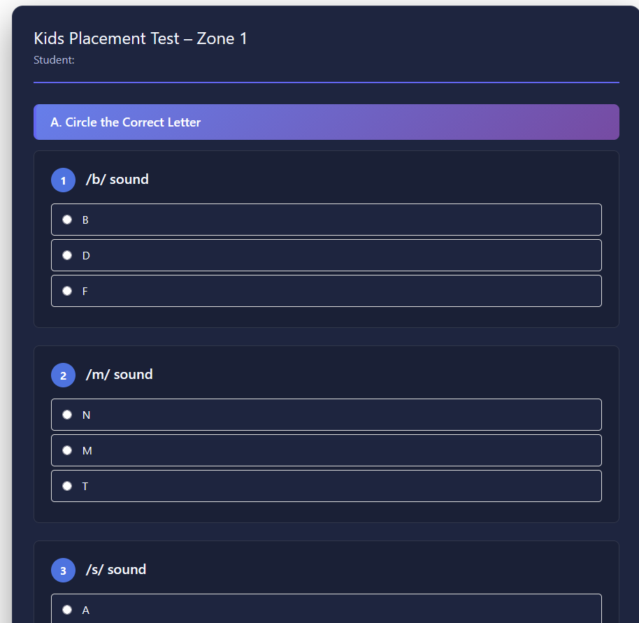
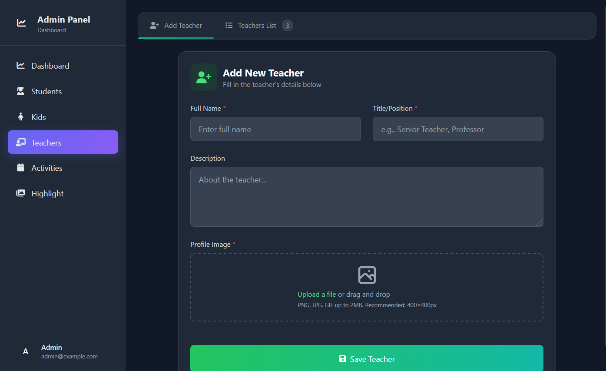
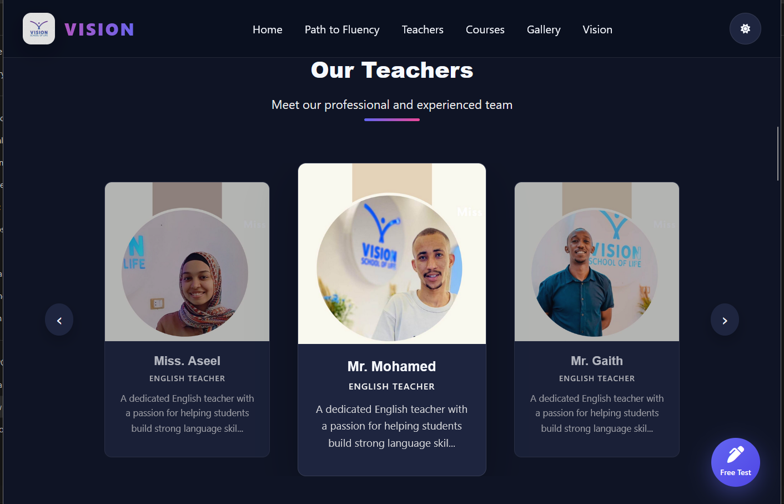

# Vision – English Learning Center Web App

Vision is a modern web application designed for an English Learning Center.  
The platform supports placement testing, student performance evaluation, activity management, and teacher highlighting through a clean and responsive dashboard.

---

## 🚀 Project Vision

The goal of VisionLearn is to provide a structured and engaging digital environment for both **Kids and adults**, helping them assess their English level, track results, and interact with educational activities while allowing administrators to manage content easily.

---

## ✨ Key Features

### 📝 Placement Test System
- Placement tests for **Kids and adults**
- Automatic score calculation
- Level-based result evaluation
- 

### 📊 Dashboard (Admin Panel)
- Upload and manage activities
- Highlight important announcements
- Manage and showcase teachers
- Organized and user-friendly interface
-  

### 🎓 Teacher Showcase
- Display teachers with profiles
- Highlight expertise and roles
 

### 📱 Responsive Design
- Fully responsive (desktop, tablet, mobile)
- Modern UI/UX for better learning experience

---
🛠️ Technologies Used

- HTML5
- CSS3 (Responsive Design)
- JavaScript
- PHP (Laravel Framework)
- MySQL

Optional / Future Enhancements

Advanced authentication & roles (Admin / Student / Teacher)
Performance analytics dashboard
Online exams & certificates
API integration
---

## 📂 Project Structure

